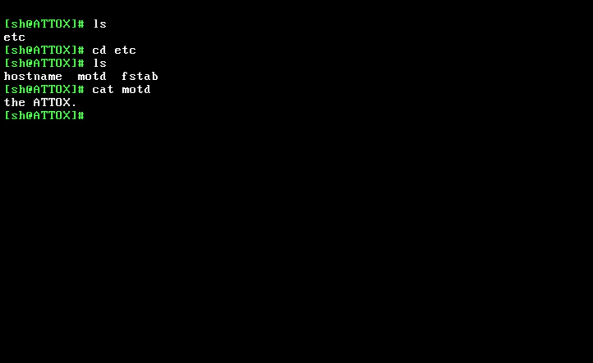

# ATTOX


ATTOX is a 32-bit x86 UNIX-like operating system kernel written in C and Assembly. 

## Features

* **Architecture:** 32-bit x86 with Ring 0 / Ring 3 hardware isolation.
* **Multitasking:** Preemptive multitasking utilizing a custom `spawn` primitive.
* **Syscall ABI:** Direct `int 0x80` system call interface via bare `_syscallN` macros (no libc wrappers).
* **VFS:** Virtual File System supporting standard I/O operations.
* **User-Space Shell:** Built-in `sh` running in Ring 3. Features include dynamic prompt generation from `/etc/hostname`, ANSI escape code parsing in the VGA driver, and native built-in commands (`cd`, `ls`, `cat`, `touch`, `mkdir`).

## System Calls

ATTOX utilizes a custom system call table:

| ID | Name | ID | Name |
|:---:|---|:---:|---|
| **2** | `spawn` | **8** | `creat` |
| **3** | `read` | **12** | `chdir` |
| **4** | `write` | **13** | `readdir` |
| **5** | `open` | **39** | `mkdir` |

## Build and Run

### Requirements
* `gcc` (`i686-elf` or native with `-m32`)
* `nasm`
* `make`
* `qemu-system-i386`

### Screenshot


### Usage

Compile the kernel and boot via QEMU:

```bash
make
make run

